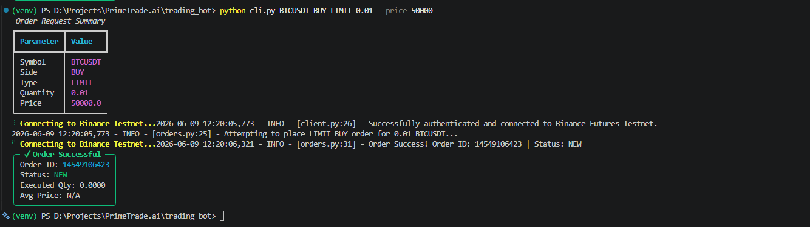

```markdown
# 📈 PrimeTrade.ai - Binance Futures Trading Bot




A robust, Python-based Command Line Interface (CLI) trading bot specifically built for the **Binance Futures Testnet**. This application features strict input validation, isolated environment configurations, and comprehensive file-based logging, wrapped in a clean terminal UI.

---

## 📦 Project Structure

```text
trading_bot/
├── bot/
│   ├── __init__.py           # Marks directory as a Python module
│   ├── client.py             # Handles secure Binance API authentication
│   ├── logging_config.py     # Application-wide logging configuration
│   ├── orders.py             # Core logic for executing MARKET and LIMIT orders
│   └── validators.py         # Input validation shield to prevent API errors
├── logs/                     
│   └── trading.log           # Auto-generated log file for all execution events
├── .env                      # Environment variables (API Keys - Local Only)
├── .gitignore                # Specifies intentionally untracked files
├── cli.py                    # Typer/Rich terminal interface (Entry Point)
└── requirements.txt          # Project dependencies

```

---

## ✨ Core Features

* **Strict Input Validation:** Pre-execution checks ensure valid symbols (e.g., BTCUSDT), exact side declarations (BUY/SELL), valid quantities, and mandatory pricing for LIMIT orders.
* **Fail-Fast Error Handling:** Safely catches Binance API exceptions (e.g., insufficient margin, invalid keys) and outputs clear, readable errors to the user instead of crashing.
* **Enhanced Terminal UI:** Utilizes `Typer` for intuitive command parsing and `Rich` for rendering status spinners, summary tables, and success panels.
* **Persistent Logging:** Every API ping, order attempt, validation error, and success state is permanently logged to `logs/trading.log` with precise timestamps.

---

## ⚙️ Setup & Installation

### 1. Initialize the Virtual Environment

Navigate to the root directory of the project and create an isolated virtual environment:

```bash
python -m venv venv

```

Activate the environment:

* **Windows:** `venv\Scripts\activate`
* **Mac/Linux:** `source venv/bin/activate`

### 2. Install Dependencies

Install the required tracking and API distribution libraries:

```bash
pip install -r requirements.txt

```

### 3. Configure Environment Variables

Create a file named `.env` in the root directory (next to `cli.py`) and paste your Testnet keys exactly like this (no spaces or quotes):

```text
BINANCE_API_KEY=your_testnet_api_key_here
BINANCE_API_SECRET=your_testnet_secret_key_here

```

---

## 💻 Usage Guide

Make sure your virtual environment `(venv)` is active before running commands.

### View the Help Menu

```bash
python cli.py --help

```

### Execute a Market Order

Buys or sells a specific quantity of an asset at the current market price.

```bash
python cli.py BTCUSDT BUY MARKET 0.01

```

### Execute a Limit Order

Places an order to buy/sell an asset only at a specifically defined price. Note the use of the `--price` flag.

```bash
python cli.py BTCUSDT BUY LIMIT 0.01 --price 50000

```

---

## 📜 Logging & Output

All application events are tracked automatically. If a trade fails, check the log file for detailed API responses:

```bash
# To view logs via terminal (Windows):
type logs\trading.log

```

> ⚠️ **Submission Note:** When packing this repository for evaluation, make sure to delete the local `venv/` folder and remove your private keys from the `.env` file to preserve security compliance.

